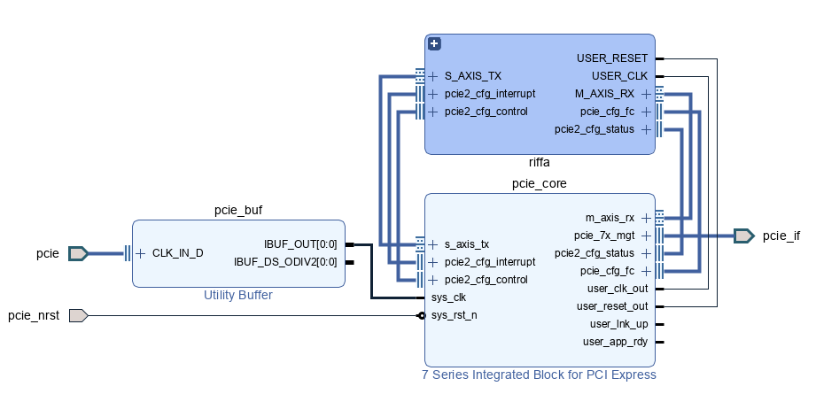

# Artix-7-PCIE-Riffa

### This project is just an extension of previous Riffa
### As XDMA on Windows 10 and 11 are introduce all kinds of trouble

Riffa repository link: https://github.com/KastnerRG/riffa

---

### For those who are not familiar with Riffa

### Riffa is an open PCIe communication design with low-resource and easy to use.

So far Windows 10 or Linux can communicate with the Riffa driver.

Additional make or compile may involves but it is sure that basic driver setup is promising.

---

## Convert previous HDL into a IP to and make life much easier on development.

### New Method

### Old Method

